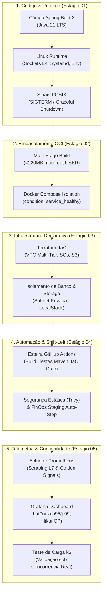

# 🚀 SecurePay DevOps & Cloud Platform Roadmap

> **Jornada de Engenharia "Do Local à Nuvem":** Da JVM no Linux local à infraestrutura corporativa na AWS com Docker, Terraform, CI/CD e Observabilidade em tempo real.  
> **Público-Alvo:** Desenvolvedor em transição para **Junior DevOps / Cloud Platform Engineer** e Backend Cloud-Native.

---

## 🧭 Metodologia Pedagógica: Fim do "Tutorial Purgatory"

Neste repositório, **não existem receitas de bolo ou comandos para copiar e colar (CTRL+C / CTRL+V)**. Cada estágio é apresentado como uma **RFC (Request for Comments) / Especificação de Problema Corporativo**:

1. **Problema Real do Negócio:** O desafio técnico enfrentado pela engenharia da SecurePay.
2. **Critérios de Aceite:** O comportamento esperado do sistema (portas, status HTTP, isolamento de rede, tempo de shutdown).
3. **Links para Documentação Oficial Primária:** Fontes oficiais do Docker, Spring Boot, PostgreSQL, Terraform e Prometheus.
4. **Juiz Mecânico Imparcial (`python3 verify.py`):** Suíte de testes determinística em Python 3 TDD que audita sockets, cgroups, HTTP e infraestrutura declarativa sem viés subjetivo.

---

## 🏛️ Os 3 Pilares do Engenheiro Maduro (Fundamentos, Negócio e Automação)

> *"Ferramenta é passageira. Fundamento fica."* — Saber subir um cluster não adianta se você não domina redes, onde moram os gargalos físicos e como o ciclo de vida funciona de ponta a ponta.

1. **Fundamentos Físicos que Não Mudam:**
   - **Redes & Protocolos:** Do socket L4 (`ss -tulpn`, TCP handshake, conntrack) ao roteamento L7 (HTTP/1.1, HTTP/2, TLS, Keep-Alive, reverse proxies).
   - **Gargalos de I/O e Memória:** Como diagnosticar saturação de disco (IOPS, throughput gp3 vs gp2, fsync do banco) e limites reais de memória no Linux (Heap JVM vs Off-heap RSS, page cache e OOMKilled cgroups v2).
2. **Entendimento de Negócio & Confiabilidade Preventiva:**
   - **Infraestrutura Orientada a Custo (FinOps):** Infraestrutura cara que não traz resiliência é desperdício. Saber calcular custos de instâncias/clusters antes de subir e desligar recursos ociosos em staging.
   - **Prevenção > Reação:** Implementar *Shift-Left Security*, healthchecks reais e tolerância a falhas para prevenir incidentes antes que o alerta de produção toque.
3. **Automação Intencional & Simplicidade (KISS):**
   - **Fluxo Certo vs Scripts Soltos:** Não acumular scripts ad-hoc quebradiços; usar IaC declarativo idempotente (Terraform) e pipelines versionadas (GitHub Actions).
   - **Anti-Overengineering:** "Simplicidade é a chave. Não antecipe problemas inexistentes." Resolver o problema real com a menor complexidade operacional possível.

---

## 🔄 Ciclo de Vida da Aplicação de Ponta a Ponta (The Full E2E Lifecycle)

Cada estágio deste laboratório cobre uma camada física e lógica do ciclo de vida corporativo:

---

## 🗺️ Trilha 1: Plataforma Spring Cloud Core (SecurePay)

| Estágio                                                                                    | Domínio Técnico                                                      | Status          | Juiz Mecânico                                                   |
| :----------------------------------------------------------------------------------------- | :------------------------------------------------------------------- | :-------------- | :-------------------------------------------------------------- |
| **[`01-linux-runtime`](./stages-labs/spring-cloud-platform/01-linux-runtime/README.md)**   | Linux, Systemd, Variáveis, Sockets L4 & Sinais POSIX (SIGTERM)       | `[x] Concluído` | `stages-labs/spring-cloud-platform/01-linux-runtime/verify.py`  |
| **[`02-docker-compose`](./stages-labs/spring-cloud-platform/02-docker-compose/README.md)** | Docker Multi-Stage (<220MB, non-root) & Compose com Healthcheck      | `[x] Concluído` | `stages-labs/spring-cloud-platform/02-docker-compose/verify.py` |
| **[`03-terraform-vpc`](./stages-labs/spring-cloud-platform/03-terraform-vpc/README.md)**   | Terraform IaC, VPC Multi-Tier, SGs Encadeados & S3 no LocalStack     | `[x] Concluído` | `stages-labs/spring-cloud-platform/03-terraform-vpc/verify.py`  |
| **[`04-github-actions`](./stages-labs/spring-cloud-platform/04-github-actions/README.md)** | CI/CD Pipeline, Testes Maven, Trivy Security Scan, IaC Gate & FinOps Staging Auto-Stop | `[ ] Ativo`     | `stages-labs/spring-cloud-platform/04-github-actions/verify.py` |
| **[`05-observability`](./stages-labs/spring-cloud-platform/05-observability/README.md)**   | Actuator Prometheus, Grafana Dashboards, Gargalos de I/O/Conexão & Teste k6 | `[ ] Pendente`  | `stages-labs/spring-cloud-platform/05-observability/verify.py`  |

---

## 🗺️ Trilha 2: Microsserviços Heterogêneos, DevSecOps & Nuvem Real

| Estágio                                                                                                   | Domínio Técnico                                                 | Status         | Juiz Mecânico                                                            |
| :-------------------------------------------------------------------------------------------------------- | :-------------------------------------------------------------- | :------------- | :----------------------------------------------------------------------- |
| **[`01-containers-e-redis`](./stages-labs/microservices-kubernetes/01-containers-e-redis/README.md)**     | Multi-Service Containers, Redis Streams & Webhook Gateway       | `[ ] Pendente` | `stages-labs/microservices-kubernetes/01-containers-e-redis/verify.py`   |
| **[`02-devsecops-gates`](./stages-labs/microservices-kubernetes/02-devsecops-gates/README.md)**           | Quality Gates no CI/CD com Gitleaks, Semgrep SAST & Trivy SCA   | `[ ] Pendente` | `stages-labs/microservices-kubernetes/02-devsecops-gates/verify.py`      |
| **[`03-kubernetes-helm`](./stages-labs/microservices-kubernetes/03-kubernetes-helm/README.md)**           | Kubernetes Local Multi-Node (kind), Helm Chart `platform-suite` | `[ ] Pendente` | `stages-labs/microservices-kubernetes/03-kubernetes-helm/verify.py`      |
| **[`04-aws-production-cloud`](./stages-labs/microservices-kubernetes/04-aws-production-cloud/README.md)** | Nuvem Real AWS, Terraform S3 Backend + DynamoDB Locking & EC2   | `[ ] Pendente` | `stages-labs/microservices-kubernetes/04-aws-production-cloud/verify.py` |

---

## 🗺️ Trilha 3: Produção em VPS Econômica & DevSecOps Puro

> **Compute Dedicado:** Arquitetura completa para hospedar aplicações de produção em VPSs de $5 a $20/mês (DigitalOcean, Hetzner, Hostinger) com Caddy v2, isolamento estrito no Docker Compose, backups off-site e CI/CD SSH.

| Estágio                                                                                                                   | Domínio Técnico                                                                 | Status         | Juiz Mecânico                                                                    |
| :------------------------------------------------------------------------------------------------------------------------ | :------------------------------------------------------------------------------ | :------------- | :------------------------------------------------------------------------------- |
| **[`01-vps-hardening`](./stages-labs/vps-devsecops-production/01-vps-hardening/README.md)**                               | Hardening Linux: UFW, SSH Key-Only, Fail2ban, Non-Root Sudoer & Swap (RFC-301)  | `[ ] Pendente` | `stages-labs/vps-devsecops-production/01-vps-hardening/verify.py`                |
| **[`02-caddy-reverse-proxy`](./stages-labs/vps-devsecops-production/02-caddy-reverse-proxy/README.md)**                   | Gateway L7 Caddy v2, TLS Automático, Security Headers & Upstreams (RFC-302)     | `[ ] Pendente` | `stages-labs/vps-devsecops-production/02-caddy-reverse-proxy/verify.py`          |
| **[`03-compose-production-isolation`](./stages-labs/vps-devsecops-production/03-compose-production-isolation/README.md)** | Docker Compose Isolado: Redes Internas, Anti-OOM Limits & DB Blindado (RFC-303) | `[ ] Pendente` | `stages-labs/vps-devsecops-production/03-compose-production-isolation/verify.py` |
| **[`04-database-backups-s3`](./stages-labs/vps-devsecops-production/04-database-backups-s3/README.md)**                   | Rotina de Backup S3 Off-site: `pg_dump` Gzip, Retenção & Restauração (RFC-304)  | `[ ] Pendente` | `stages-labs/vps-devsecops-production/04-database-backups-s3/verify.py`          |
| **[`05-cicd-vps-deploy`](./stages-labs/vps-devsecops-production/05-cicd-vps-deploy/README.md)**                           | CI/CD DevSecOps: Trivy + Gitleaks Gates & Deploy Contínuo via SSH (RFC-305)     | `[ ] Pendente` | `stages-labs/vps-devsecops-production/05-cicd-vps-deploy/verify.py`              |

---

## 🗺️ Trilha Ponte: DevSecOps Gates (03→04)

> **Ponte entre o Estágio 03 e o Estágio 04:** estes 3 gates de segurança aparafusam na pipeline do estágio 04 (higiene de segredos, SAST e endurecimento do pipeline) antes do deploy contínuo.

| Estágio                                                                                      | Domínio Técnico                                                                        | Status         | Juiz Mecânico                                                 |
| :------------------------------------------------------------------------------------------- | :------------------------------------------------------------------------------------- | :------------- | :------------------------------------------------------------ |
| **[`01-secrets-hygiene`](./stages-labs/devsecops-gates/01-secrets-hygiene/README.md)**       | Higiene de Segredos: Gitleaks, vazamento de `.env` & baseline                          | `[ ] Pendente` | `stages-labs/devsecops-gates/01-secrets-hygiene/verify.py`    |
| **[`02-sast-semgrep`](./stages-labs/devsecops-gates/02-sast-semgrep/README.md)**             | SAST com Semgrep: regras ERROR sobre Java                                              | `[ ] Pendente` | `stages-labs/devsecops-gates/02-sast-semgrep/verify.py`       |
| **[`03-pipeline-hardening`](./stages-labs/devsecops-gates/03-pipeline-hardening/README.md)** | Endurecimento de Pipeline: permissões least-privilege & script de auditoria de SHA pin | `[ ] Pendente` | `stages-labs/devsecops-gates/03-pipeline-hardening/verify.py` |

---

## 🗺️ Trilha 4: Maestria Arquitetural, FinOps & Confiabilidade de Sistemas (Entrevistas Técnicas)

> **Manual de Apoio:** [`Guia Definitivo de Entrevistas Técnicas (DevOps, Cloud & Platform Engineering)`](./docs/interview-prep/devops-cloud-interview-guide.md)

| Estágio                                                                                                              | Domínio Técnico                                                                      | Status         | Juiz Mecânico                                                                |
| :------------------------------------------------------------------------------------------------------------------- | :----------------------------------------------------------------------------------- | :------------- | :--------------------------------------------------------------------------- |
| **[`01-architectural-tradeoffs`](./stages-labs/interview-prep-finops/01-architectural-tradeoffs/README.md)**         | Defesa de Decisões de Plataforma, Matriz de Trade-offs & ADRs (RFC-201)              | `[ ] Pendente` | `stages-labs/interview-prep-finops/01-architectural-tradeoffs/verify.py`     |
| **[`02-finops-cloud-cost`](./stages-labs/interview-prep-finops/02-finops-cloud-cost/README.md)**                     | Auditoria FinOps, Redução >70% de Fatura AWS, Right-Sizing K8s & Graviton (RFC-202)  | `[ ] Pendente` | `stages-labs/interview-prep-finops/02-finops-cloud-cost/verify.py`           |
| **[`03-incident-triage-postmortems`](./stages-labs/interview-prep-finops/03-incident-triage-postmortems/README.md)** | Triagem Forense de Falhas P1, Telemetria Blackbox & Blameless Post-Mortems (RFC-203) | `[ ] Pendente` | `stages-labs/interview-prep-finops/03-incident-triage-postmortems/verify.py` |
| **[`04-mock-interviews-and-drills`](./stages-labs/interview-prep-finops/04-mock-interviews-and-drills/README.md)**   | Simulador Interativo CLI de Banca Examinadora Técnica (Tech Lead & EM) (RFC-204)     | `[ ] Pendente` | `stages-labs/interview-prep-finops/04-mock-interviews-and-drills/verify.py`  |

---

## 🗺️ Trilhas de Laboratório Sob Demanda (`stages-labs/`)

> **Trilhas Especializadas Geradas via `@learning-path-builder`:** Arenas de combate modulares e autocontidas com oráculos mecânicos dedicados.

### 🚀 Trilha Lab: Automação de Servidores com Ansible

- **Diretório:** [`stages-labs/ansible/`](./stages-labs/ansible/) | **ROADMAP Completo:** [`stages-labs/ansible/ROADMAP.md`](./stages-labs/ansible/ROADMAP.md)
- **Laboratório Docker Local:** [`stages-labs/ansible/lab/`](./stages-labs/ansible/lab/) (6 nós na rede `10.99.0.0/16`)

| Estágio                                                                                  | Domínio Técnico                                                                             | Status         | Juiz Mecânico                                           |
| :--------------------------------------------------------------------------------------- | :------------------------------------------------------------------------------------------ | :------------- | :------------------------------------------------------ |
| **[`01-inventario-e-conexao`](./stages-labs/ansible/01-inventario-e-conexao/README.md)** | Inventário INI/YAML, SSH Key-Only, ping `pong` e comandos ad-hoc (RFC-ANS-001)              | `[ ] Pendente` | `stages-labs/ansible/01-inventario-e-conexao/verify.py` |
| **[`02-playbooks-e-modulos`](./stages-labs/ansible/02-playbooks-e-modulos/README.md)**   | Playbooks declarativos, módulos core (`apt`, `user`), handlers e idempotência (RFC-ANS-002) | `[ ] Pendente` | `stages-labs/ansible/02-playbooks-e-modulos/verify.py`  |
| **[`03-roles-e-templates`](./stages-labs/ansible/03-roles-e-templates/README.md)**       | Roles reutilizáveis, Jinja2 (`.j2`) com condicionais/loops e precedência (RFC-ANS-003)      | `[ ] Pendente` | `stages-labs/ansible/03-roles-e-templates/verify.py`    |
| **[`04-galaxy-e-ci-cd`](./stages-labs/ansible/04-galaxy-e-ci-cd/README.md)**             | Ansible Galaxy, `ansible-lint`, Molecule testes e esteira CI/CD (RFC-ANS-004)               | `[ ] Pendente` | `stages-labs/ansible/04-galaxy-e-ci-cd/verify.py`       |

---

## 🛑 Contratos Rígidos Anti-Alucinação (Fronteiras de Não-Escopo)

A IA e o Aluno devem respeitar estritamente o que **NÃO pode ser cobrado ou inventado** em cada estágio:

### Estágio 01: Linux & Runtime Local

- ❌ **Proibido Cobrar:** Docker, Docker Compose, Terraform, Kubernetes, LocalStack, CI/CD.
- ✅ **Foco Exclusivo:** Processos Linux, permissões de arquivo, variáveis de ambiente no `.env`, portas locais (`ss -tulpn`), PostgreSQL no host e script de healthcheck em bash.

### Estágio 02: Conteinerização Profissional com Docker

- ❌ **Proibido Cobrar:** Terraform, Kubernetes/Helm, LocalStack AWS, AWS ECS/EKS, CI/CD remoto.
- ✅ **Foco Exclusivo:** Multi-stage `Dockerfile`, redução de camada e imagem enxuta Alpine, usuário sem privilégios (`USER spring`), `docker-compose.yml` com ordenação `condition: service_healthy` e persistência de volume.

### Estágio 03: Infraestrutura como Código (Terraform no LocalStack)

- ❌ **Proibido Cobrar:** Kubernetes, Helm, CloudWatch Logs avançado, AWS EKS, esteiras de CI/CD.
- ✅ **Foco Exclusivo:** Terraform HCL, Provider AWS local (`localhost:4566`), VPC `10.0.0.0/16` com subnets pública/privada/isolada, Security Groups sem vazamento na porta 5432, Bucket S3 privado e detecção empírica de drift (`terraform plan`).

### Estágio 04: Esteira de CI/CD com GitHub Actions

- ❌ **Proibido Cobrar:** Kubernetes GitOps (ArgoCD/Flux), AWS ECS Fargate deploy, Ansible.
- ✅ **Foco Exclusivo:** Workflow YAML no GitHub Actions, build e testes Maven (`./mvnw verify`), build da imagem Docker, escaneamento de vulnerabilidades estáticas com Trivy (`trivy image --severity HIGH,CRITICAL`), e validação de sintaxe Terraform (`terraform fmt` e `validate`).

### Estágio 05: Observabilidade & Confiabilidade (SRE)

- ❌ **Proibido Cobrar:** Jaeger Distributed Tracing com OpenTelemetry Collector, Chaos Engineering complexo, clusters Elasticsearch/ELK.
- ✅ **Foco Exclusivo:** Scraping do `/actuator/prometheus`, configuração do `prometheus.yml`, importação de Dashboard no Grafana (RPS, Latência p95/p99, pool HikariCP) e simulação de concorrência com **k6** provando integridade sem starvation de banco.

### Trilha Parte 4: Prontidão para Entrevistas, Defesa de Trade-offs & FinOps

- ❌ **Proibido Cobrar (Fronteira de Não-Escopo):** Implementação de algoritmos de consenso do zero em C/Rust; escrita de drivers eBPF de baixo nível no kernel; arquiteturas ativas-ativas multi-região globais além de Cloud Platform.
- ✅ **Foco Exclusivo (Escopo):** Defesa de decisões arquiteturais ("Por que X e não Y?"), auditoria e otimização FinOps (VPC Endpoints, Graviton, Spot, gp3), análise forense de telemetria de incidentes P1 e performance em entrevistas técnicas (Método STAR).
